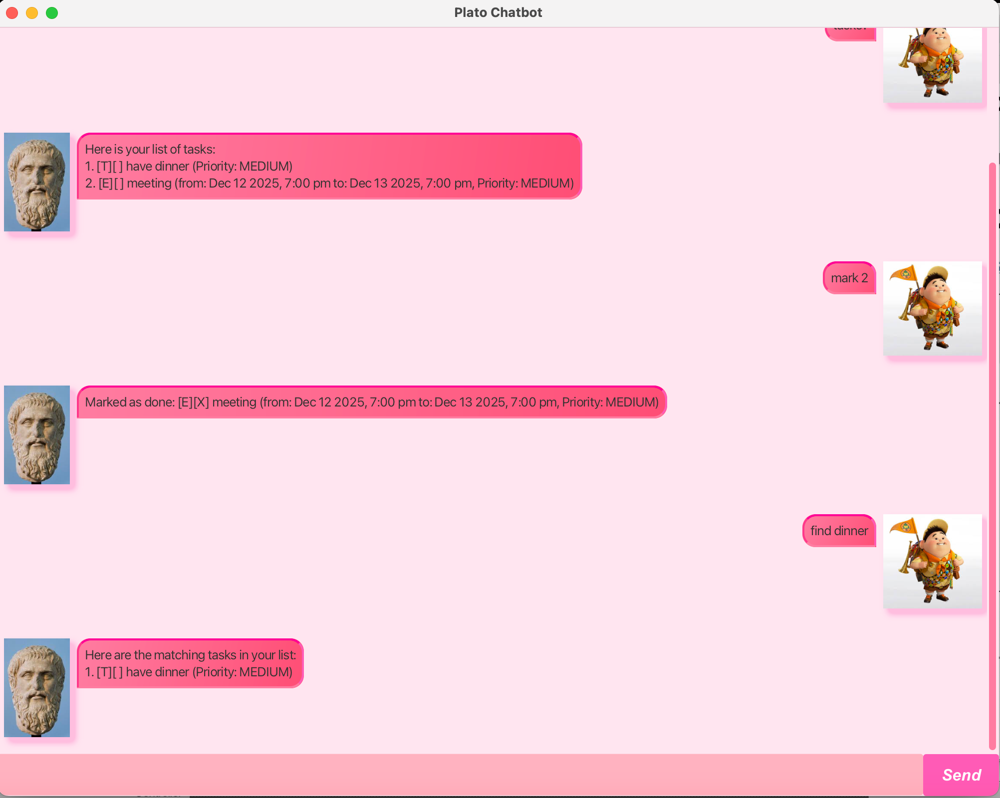

# Plato User Guide



Plato is a lightweight **task manager** designed to help users keep track of their **to-dos, deadlines, and events** efficiently through a simple and intuitive interface.

---


## Adding deadlines

You can add a **deadline** task using the following format:

deadline <task description> /by <YYYY-MM-DD HHmm>

Example: deadline Submit report /by 2025-03-05 2359

```
Added: [D][ ] Submit report (by: Mar 5 2025, 11:59pm)
```

## Feature: Listing All Tasks

To display all tasks, use:
tasks?

```
Added: [D][ ] Submit report (by: Mar 5 2025, 11:59pm)
```

Here are your tasks:

[T][✓] Buy groceries
[D][ ] Submit report (by: Mar 5 2025, 11:59pm)


## Feature: Exiting the Application
To close Plato, use:
Farewell


---

## Additional Features

| **Feature**      | **Command**                            | **Description** |
|------------------|----------------------------------------|----------------|
| Add a To-Do      | `todo <task>`                          | Adds a to-do task |
| Add a Deadline   | `deadline <task> /by <date>`           | Adds a task with a due date |
| Add an Event     | `event <task> /from <date> /to <date>` | Adds an event with a specific time |
| Mark Done        | `mark <index>`                         | Marks a task as completed |
| Mark as Not Done | `unmark <index>`                       | Marks a task as completed |
| Delete Task      | `delete <index>`                       | Removes a task |
| Find Task        | `find <keyword>`                       | Searches for tasks |
| List Tasks       | `tasks?`                               | Displays all tasks |
| Exit             | `Farewell`                             | Closes the program |

---

## Quick Start

1. **Run Plato** from the terminal using: java -jar Plato.jar
2. **Enter commands** to manage your tasks.
3. **Use `tasks?`** to check your tasks anytime.
